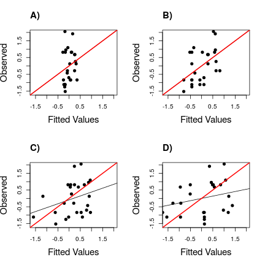

Comparing dispersal, environmental and mid-domain effects on species distribution
============================

##### By Dambros, Cáceres, Magnus, and Gotelli

>html updated at 2014-05-02 11:48:45

### Methods

#### Study site
 
  The study was conducted in the whole area recognized as the Atlantic forest biome (Fig. 1). This biome encompasses an extent of 102,012 km², but today representing only 7.9% of its original forest cover. It has several vegetation types such as rainforests, mixed (Araucarian) moist forests, semideciduous forests, dry forests and upland grasslands. Rainforests tend to occur near the coast and semideciduous and dry forests far from coast; mixed forests are common in the south of AF (SOS Mata Atlântica 2007). AF shows moist tropical and subtropical climates, without well-defined dry season, and annual mean temperatures above 15ºC (Leite, 2002). 

#### Data collection

  We compiled a database based on the literature in which diverse authors have sampled small mammals along the AF (Appendix S1 in Supporting Information). We have used Google @ search tool for sampling articles, and the main keywords used in combination were “small mammal”, “marsupial”, “rodent”, “community”, “composition”, “richness”, “diversity”, and “Atlantic Forest”. Unpublished data sampled by NCC was also included (Appendix S1). There was some variation in the area covered by each surveyed study (see Appendix S1), but we have established a minimum of sampling effort for a given article to be accepted in our database: at least 1000 trap-nights, 6 months of field work, and use of wire type and/or Sherman live-traps installed on the ground or understory level of the forest. Besides that, and for independence assumptions, we have chosen surveyed areas distant at least 10 km from each other; most of the field surveys available in the literature sampled only one geographical location under this condition. From each selected survey, we obtained local species composition and abundance data when available. 
  We compiled the 19 environmental variables available in Bioclim (www.worldclim.org/bioclim) in a scale of 2.5 arc minutes: annual mean temperature (1), mean diurnal range (2), isothermality (3), temperature seasonality (4), maximum and minimum temperature of the warmest and coldest months (5 and 6), temperature annual range (7), mean temperature of the wettest, driest, warmest and coldest quarters (8-11), annual precipitation (12), precipitation of the wettest and driest months (13 and 14), precipitation seasonality (15), and precipitation of the wettest, direst, warmest and coldest quarters (16-19). Because most of the variables are correlated to each other, the climatic variables were summarized in a Principal Component axis. This axis was used a predictor variable in all models. We present the results using individual variables as supplements (see below).  
  Data on habitat quality were taken directly from information available on the articles consulted, and classified as categories of forest conservation (degrees 1 to 5), where a score of 5 means primary pristine forest, and disturbed secondary forest, including with clearings, has a score of 1.

#### Analysis

  The standardized variables of habitat quality and the summarized climatic variables (PCA.clim1) were used as predictors of the species diversity and included in simulation models (see below). Latitude and Longitude were highly correlated with the climatic variables, so they were not included in the models as predictor variables, but were used to calculate the pairwise distance among sampling units.

  We analyzed the data using the original local sampling units and grouping the original data points in 26 2x2 degrees grid cells (Fig. 1). Most localities were surveyed by a single study, then most of the sampling points represent a single study (see data collection). The number of species encountered in each locality (S; alpha diversity), and the similarity in species composition (beta diversity) were used as response variables.
  The similarity in species composition was accessed by calculating the Jaccard similarity index among all pairs of samples. The matrix of similarities was summarized using a Principal Coordinates Analysis (PCoA). We used only the first two ordination axes because all axes in higher dimensions captured alone less than 10% of the variation from the similarity matrix.

 

###### Fig. 1. Map of the Atlantic Forest (AF; blue shade) showing the orinal sampling points (red circles) and the grid cells encompassing the entire AF. The size of the circles represent the size o the original sampling area in the log scale. Green shade represent the grid cells where small mammal data was available. 

####

##### Dispersal-based models

  For estimating the influence of dispersal limitation on species local diversity (S) and turnover (Jaccard index; PCoA1 and PCoA2), we created a network of interconnected grid cells representing the AF. This network was used to determine the flux of species or individuals between grid cells in simulation models (Fig. S2). Two models were used to recreate the species distribution under dispersal alone: the mid domain spreading-dye model (Colwell and Hurtt 1994; Colwell and Lees 2000), and the analytical neutral approach borrowed from the population genetics (Nagylaki, 1980) and presented by Economo & Keitt (2008) for community ecology. These models were created just using the grouped data in grid cells because of the completeness of data, and due to computational limitation.
  In the mid domain spreading dye model, the number of grid cells occupied by each small mammal species was recorded. For each species, one of the 26 grid cells was randomly selected and the species occurrence was spread from the selected cell to neighboring cells until the original number of grid cells was occupied. This procedure was repeated 10,000 times for the 64 species. Each cell had up to eight neighbors (Moore neighborhood; Fig. S2), and the model was bounded by the domain where actual small mammal data was recorded (26 grid cells).

  In the neutral model, the whole area comprising the AF was divided in 56 2x2 degrees grid cells from which 26 had small mammal data available (Fig. 1). The model started with a single species occupying all the 56 cells. In each generation, new species were added in each cell by point speciation with rate $\nu$, set the same for al cells (see Economo & Keitt (2010) and Muneepeerakul et al. (2008) for more details and other uses). $\nu$ represents the probability of an individual to become a new species but could also represent the addition of new species by immigration from a larger species pool outside the AF (eg. the Cerrado or Amazonian forests). To recreate the dispersal of individuals, we determined that a cell could just be colonized by a neighbor (Moore neighborhood; Fig S2), and that all grid cells had the same migration rate (parameter $m$). The local community size (number of individuals) was set the same for all grid cells ($N$ = 100). The model was run for multiple generations, until the diversity within (PIE and HillPIE) and between all cells (Morisita-Horn similarity) reached a steady-state (usually more than 30,000 generations).

  Differently from the Mid-domain model, the values of $m$, $\nu$, and $N$ were initially set independently of the observed data. Because different combinations of these parameters can create the same patterns of species distribution (Etienne 2006?; Economo and Keitt 2010), and because estimates for these parameters based on empirical data are not available, we did not attempt to estimate realistic parameters, but focused on the general patterns that the model could produce (see discussion for implications of this procedure). $N$ was arbitrarily defined as 100 individuals for all grid cells, and $m$ and $\nu$ were used as knobs to best fit the model to the observed similarity in species composition. These parameters were simultaneously tunned using the L-BFSG-S optimization algorithm. In summary, $m$ and $\nu$ were adjusted to minimize the differences between the predictions of the neutral model to the observed data, giving the best possible explanation of dispersal to the observed data (this procedure is conceptually analog to a regression analysis using maximum likelihood optimization). Because the number of individuals per grid cell was kept constant during the optimization, the differences in diversity were due to the location of a cell in the network and the number of neighbor grid cells, but not affected by the differences in abundance.

  The model proposed by Economo and Keitt (2008) is probabilistic and does not require the simulation of each individual in the metacommunity, being less computationally intensive. This model allowed us to investigate thoroughly the parameter space of $m$ and $\nu$ to find the best explanatory model to the observed data. However, because the model is based on probabilities, it does not allow one to calculate statistics based on the raw data (eg. the Jaccard similarity index). Because not all original studies recorded species abundances, we compared the Morisita-Horn similarity matrix from the neutral model with the observed Jaccard similarity for optimization. These indexes are usually highly correlated (Chao et al., 2006; Krasnov et al., 2005) and we believe this procedure did not have profound effects on the neutral fit.
  To calculate the Jaccard similarity index from the neutral model, each individual in the metacommunity was simulated using the previously optimized parameters. We run an initial buffer of 30,000 generations. Then the model was run for additional 1000 generations 5,000 times, representing 5,000 simulations. The mean of all the 5,000 simulations was used to calculate the remaining summary statistics (see below). The correlation between the probabilistic and the simulated model was 99.98% when comparing the Morisita-Horn index of pairwise similarity, so we believe the simulations run long enough to capture the final predictions of the neutral model.

##### Deterministic models - Environmental effects

To test the association of the species diversity with the climatic and habitat quality variables, individual logistic regressions were fit for all species against these predictor variables, allowing each species to vary independently of one another.

 The probability of occurrence generated by the logistic model for each species was summed to estimate the expected number of species in each quadrant:
  
$$
\hat S_i = \sum_{j=1}^{S}{\frac{e^{X_i\beta_j}}{1+e^{X_i\beta_j}}}
$$
  
Where $X_i$ denotes a vector of the environmental variables in the quadrant $i$, and $\beta_j$ is a vector with the coefficients from the logistic regression for the species $j$.

To calculate the raw statistics based on these probabilities, the distribution of each species was simulated based on the probabilities of occurrence generated by the logistic curve, similarly to what was done for the neutral model. For each species, the number of grid cells where the species was observed was counted. The model spread each species into the map based on its probability of occurrence until the number of grid cells occupied in the simulation matched the number observed. This allowed each species to vary independently, and to the relationship between the environmental variables and the response variables (eg. number of species) to be non-linear. Differently from the non-linearities that could be used in other statistical tests, such as Generalized Additive Models, the deterministic part of this model has an underlying mechanistic function (logistic). Note that this model does not require the species to have continuous ranges as in the mid domain model.

##### Model Comparisons

We compared the three simulation models (Mid Domain, Neutral, and based on logistic regressions) by their Mean Square Error (MSE; Gotelli et al. 2009). The MSE was calculated as the sum of the squared bias and model variance, so the MSE is a balance between precision and accuracy (see Gotelli et al. 2009 and Appendix S3 for detailed description).

Alternatively, we tested for the direct association of the response variables against the environmental predictors and present these results as supplements. For this test, linear regression models (OLS) were fit for species richness and the two ordination axes of species composition. For the original sampling units, the OLS models had the climatic and habitat quality variables as predictors. For the grouped data, we created three sets of models: (1) Using just the climatic and habitat quality variables as predictors; (2) using just the neutral and mid domain models as predictors; (3) using the neutral and mid domain predictions as predictor variables along with the climatic and habitat quality variables, as suggested by Letten et al. (2013); and (4) using the neutral and mid domain predictions as null hypotheses, and testing for the association of residuals with the climatic and habitat quality variables. Both the raw environmental variables and the prediction from the logistic simulations were used as predictor variables. This gave a total of 20 models (REnv; Neutral; MidD; REnv+Neutral; REnv+MidD; LEnv; REnv+Neutral; REnv+MidD; ResNeutral+Env;  ResMidD+Env; Table 2; Table 4). We assumed normality in the residuals of all models. The models were compared by their AIC values.
  The regression coefficients were set to 1 for the neutral, mid domain, and logistic simulation predictors, so this parameter was not allowed to vary. We did not include an intercept in the models using only these variables as predictors as well, then there were no extra coefficients to be estimated besides the standard deviation in the residuals (one extra parameter). Note however that an intercept and slope were calculated for each species in the logistic models. These extra parameters are added as penalties for the AIC calculations.

  

##### Distance-decay analyses

  Finally, we tested for patterns of distance-decay in the species similarity using simple and partial Mantel tests correlating the matrix of Jaccard similarity (M) to the geographical distance (D), and environmental dissimilarity (E) matrices (Euclidean distance) (see Thompson and Townsend 2006 for a similar approach). Legendre et al. (2005) and Tuomisto and Ruokolainen (2006; 2008) suggest using multiple regression on similarity matrices to separate the effects of niche and neutral processes. However, there is a strong debate about the validity of these models (Legendre et al. 2008; Tuomisto and Ruokolainen 2008). Some authors also suggest using partial Redundancy Analysis (Borcard et al. 1992) for this purpose (Gilbert and Lechowicz 2004), but this method also has serious limitations (Smith and Lundholm 2010). We preferred to base our discussion on the mantel tests and multiple regressions using the summarized data (each grid cell as a unit), as described above. We used (simple) generalized linear models (GLMs) with log links to estimate the relationship between the similarity in species composition and geographical or environmental distances (Millar et al. 2011). Because the Jaccard similarity is a proportion (proportion of shared species), the error of this model was fit with a binomial distribution (Millar et al. 2011). The R-squares of the GLMs was calculated by using the McFadden's apporach (McFadden 1974).

  All the analyses were conducted in the R program (R Development Core Team, 2013). The models and most of the summary statistics calculations were implemented by the authors, and are available as a supplementary material (see Appendix SXX). We used the packages vegan (Oksanen et al., 2008) for the remaining analyses.

  	
### Results

  All the models had a very poor fit to species richness (Table 1; Fig. 2; Fig. S2). The model with the lowest mean square error and bias was the logistic simulation using habitat quality as a predictor of species presence (Table 1). The model with the lowest variance was the neutral model, but the difference among the models was much smaller than for the bias (Table 1).

Similarly, the regression model with the highest explained variance was the logistic model against habitat quality (Table 1). However, this model have one of the highest AICs due to the high number of parameters estimated. The remaining models explained less than 10% of the variation in species richness (Table 1).
  Besides the poor fit for the data, the Mid Domain and Neutral models created the well known richness peak in the central areas of the Atlantic forest (Fig. 2).
  In the small grain (original sampling units), the habitat quality and climatic variables were able to explain 12% and 2% of the variation in species richness.

###### Table 1. AIC values comparing the 10 regression models tested for species Richness. MR1.1: Environmental variables as predictors; MR1.2: Environmental variables + Neutral as predictors; MR1.3: Environmental variables + Mid Domain as predictors; MR1.4: Neutral; MR1.5: Mid Domain; MR1.6: Environmental variables as predictors of residuals from Neutral; MR1.7:  Environmental variables as predictors of residuals from Mid Domain; MR1.8: Logistic models as predictors; MR1.9: Logistic model + Neutral as predictors; MR1.10: Logistic model + Mid Domain as predictors.

####

<TABLE border=1, bgcolor=#989898>
<TR> <TH>  </TH> <TH> Model </TH> <TH> logLik </TH> <TH> npar </TH> <TH> AIC </TH> <TH> rsquares </TH> <TH> BIASsq </TH> <TH> VAR </TH> <TH> MSE </TH>  </TR>
  <TR> <TD align="right"> 8 </TD> <TD> Cimatic </TD> <TD align="right"> -36.32 </TD> <TD align="right"> 65.00 </TD> <TD align="right"> 202.63 </TD> <TD align="right"> 0.01 </TD> <TD align="right"> 1363.23 </TD> <TD align="right"> 180.92 </TD> <TD align="right"> 1544.15 </TD> </TR>
  <TR> <TD align="right"> 16 </TD> <TD> Habitat </TD> <TD align="right"> -33.31 </TD> <TD align="right"> 65.00 </TD> <TD align="right"> 196.63 </TD> <TD align="right"> 0.21 </TD> <TD align="right"> 1033.74 </TD> <TD align="right"> 201.66 </TD> <TD align="right"> 1235.41 </TD> </TR>
  <TR> <TD align="right"> 5 </TD> <TD> Mid domain </TD> <TD align="right"> -41.22 </TD> <TD align="right"> 1.00 </TD> <TD align="right"> 84.45 </TD> <TD align="right"> 0.08 </TD> <TD align="right"> 1280.47 </TD> <TD align="right"> 189.81 </TD> <TD align="right"> 1470.28 </TD> </TR>
  <TR> <TD align="right"> 4 </TD> <TD> Neutral </TD> <TD align="right"> -37.19 </TD> <TD align="right"> 3.00 </TD> <TD align="right"> 80.39 </TD> <TD align="right"> 0.09 </TD> <TD align="right"> 1518.38 </TD> <TD align="right"> 145.41 </TD> <TD align="right"> 1663.79 </TD> </TR>
   </TABLE>

###

 

###### Fig 2. Projection of the species richness predicted by dispersal models on the map and comparison with the observed species distribution. Warmer colors represent areas with hiher species richness. (A) Observed species richness; (B) Predicted by the climatic variables in the logistic models; (B) Predicted by habitat quality in the logistic models; (D) Predicted by the Mid Domain model; (E) Predicted by the neutral model. Blank cells represent areas included in the neutral model but where actual data is not available.

####

  The similarity in species composition summarized by the first ordination axis was well fit for both the neutral, the Mid Domain, and the climatic models when comparing their explanatory power (Table 1). The mid domain model had the lowest MSE, and the mid domain and the neutral model had the lowest bias (Table 1). For the second ordination axis, all models had a poor explanatory power (R²<=15; Table 1). The lowest bias was obtained by the neutral model, and the lowest MSE by the habitat quality model. The lowest AICs were obtained by the neutral and mid domain models for both axes.
Habitat quality was a poor predictor of both ordination axes.

####

###### Table 2. AIC values comparing the 10 regression models tested for species composition. Specias composition was measured as the first (MC1) and second (MC2) axes of the principal component analysis summarizing the jaccard similarity matrix. MC1.1 and MC2.1: Environmental variables as predictors; MC1.2 and MC2.2: Environmental variables + Neutral as predictors; MC1.3 and MC2.3: Environmental variables + Mid Domain as predictors; MC1.4 and MC2.4: Neutral; MC1.5 and MC2.5: Mid Domain; MC1.6 and MC2.6: Environmental variables as predictors of residuals from Neutral; MC1.7 and MC2.7:  Environmental variables as predictors of residuals from Mid Domain; MR1.8 and MC2.8: Logistic models as predictors; MC1.9 and MC2.9: Logistic model + Neutral as predictors; MC1.10 and MC2.10: Logistic model + Mid Domain as predictors.

####

<TABLE border=1, bgcolor=#989898>
<TR> <TH>  </TH> <TH> Model </TH> <TH> logLik </TH> <TH> npar </TH> <TH> AIC </TH> <TH> rsquares </TH> <TH> BIASsq </TH> <TH> VAR </TH> <TH> MSE </TH>  </TR>
  <TR> <TD align="right"> 8 </TD> <TD> Cimatic </TD> <TD align="right"> -23.74 </TD> <TD align="right"> 65.00 </TD> <TD align="right"> 177.48 </TD> <TD align="right"> 0.62 </TD> <TD align="right"> 4.22 </TD> <TD align="right"> 2.18 </TD> <TD align="right"> 6.40 </TD> </TR>
  <TR> <TD align="right"> 16 </TD> <TD> Habitat </TD> <TD align="right"> -34.86 </TD> <TD align="right"> 65.00 </TD> <TD align="right"> 199.73 </TD> <TD align="right"> 0.11 </TD> <TD align="right"> 4.18 </TD> <TD align="right"> 1.40 </TD> <TD align="right"> 5.58 </TD> </TR>
  <TR> <TD align="right"> 5 </TD> <TD> Mid domain </TD> <TD align="right"> -20.11 </TD> <TD align="right"> 1.00 </TD> <TD align="right"> 42.23 </TD> <TD align="right"> 0.73 </TD> <TD align="right"> 1.67 </TD> <TD align="right"> 2.91 </TD> <TD align="right"> 4.58 </TD> </TR>
  <TR> <TD align="right"> 4 </TD> <TD> Neutral </TD> <TD align="right"> -19.63 </TD> <TD align="right"> 3.00 </TD> <TD align="right"> 45.26 </TD> <TD align="right"> 0.74 </TD> <TD align="right"> 1.50 </TD> <TD align="right"> 5.54 </TD> <TD align="right"> 7.03 </TD> </TR>
  <TR> <TD align="right"> 26 </TD> <TD> Cimatic </TD> <TD align="right"> -35.84 </TD> <TD align="right"> 65.00 </TD> <TD align="right"> 201.68 </TD> <TD align="right"> 0.04 </TD> <TD align="right"> 1.92 </TD> <TD align="right"> 1.14 </TD> <TD align="right"> 3.06 </TD> </TR>
  <TR> <TD align="right"> 34 </TD> <TD> Habitat </TD> <TD align="right"> -36.38 </TD> <TD align="right"> 65.00 </TD> <TD align="right"> 202.76 </TD> <TD align="right"> 0.00 </TD> <TD align="right"> 1.88 </TD> <TD align="right"> 1.05 </TD> <TD align="right"> 2.93 </TD> </TR>
  <TR> <TD align="right"> 23 </TD> <TD> Mid domain </TD> <TD align="right"> -39.00 </TD> <TD align="right"> 1.00 </TD> <TD align="right"> 80.01 </TD> <TD align="right"> 0.15 </TD> <TD align="right"> 2.08 </TD> <TD align="right"> 2.91 </TD> <TD align="right"> 4.99 </TD> </TR>
  <TR> <TD align="right"> 22 </TD> <TD> Neutral </TD> <TD align="right"> -39.79 </TD> <TD align="right"> 3.00 </TD> <TD align="right"> 85.59 </TD> <TD align="right"> 0.12 </TD> <TD align="right"> 1.70 </TD> <TD align="right"> 4.39 </TD> <TD align="right"> 6.09 </TD> </TR>
   </TABLE>

###

 

###### Fig 3. Projection of the species composition predicted by dispersal models on the map and comparison with the observed species distribution. The colors represent the similarity in species composition measured by the pairwise jaccard similarity index between sites summirized in one axis of a principal coordinates analysis (pcoa). Those grid cells with similar colors have a similar composition of species. (A) Observed species composition; (B) Species composition predicted by the climatic variables in the logistic models; (C) Species composition predicted by habitat quality in the logistic models; (D) Species composition predicted by the Mid Domain model; (E) Species composition predicted by the neutral model. Shadded grid cells represent areas included in the neutral model but where actual data is not available.

####

  The mantel test results showed a stronger climatic effect on species composition when grouping the data in grid cells (Table 3). The geographical distance was highly correlated with the species composition in both cases. Geographical distance was correlated with the species composition when the climatic effect was partialed out, but the correlation was stronger in the unconstrained model (Table 3). The similarity in species composition was also weakly associated with the climatic variables when controlling for geographical distance in the grouped data. Habitat quality was a poor predictor of species composition in all models (Table 3).

###### Table 3. Mantel and partial Mantel test results comparing the correlation of species similarity against geographical distance and environmental dissimilarity. The minus sign indicate partial results (Geo - Env: Geographical distance without the effect of environmenal dissimilarity).

####

<TABLE border=1, bgcolor=#989898>
<TR> <TH>  </TH> <TH> statistic </TH> <TH> signif </TH>  </TR>
  <TR> <TD align="right"> Local Geo </TD> <TD align="right"> 0.48 </TD> <TD align="right"> 0.00 </TD> </TR>
  <TR> <TD align="right"> Local Clim </TD> <TD align="right"> 0.37 </TD> <TD align="right"> 0.00 </TD> </TR>
  <TR> <TD align="right"> Local Hab </TD> <TD align="right"> 0.01 </TD> <TD align="right"> 0.41 </TD> </TR>
  <TR> <TD align="right"> 2d Geo </TD> <TD align="right"> 0.49 </TD> <TD align="right"> 0.00 </TD> </TR>
  <TR> <TD align="right"> 2d Env </TD> <TD align="right"> 0.40 </TD> <TD align="right"> 0.00 </TD> </TR>
  <TR> <TD align="right"> 2d Hab </TD> <TD align="right"> 0.02 </TD> <TD align="right"> 0.36 </TD> </TR>
  <TR> <TD align="right"> Local Geo-Env </TD> <TD align="right"> 0.35 </TD> <TD align="right"> 0.00 </TD> </TR>
  <TR> <TD align="right"> Local Env-Geo </TD> <TD align="right"> 0.12 </TD> <TD align="right"> 0.01 </TD> </TR>
  <TR> <TD align="right"> Local Hab-Geo </TD> <TD align="right"> -0.02 </TD> <TD align="right"> 0.76 </TD> </TR>
  <TR> <TD align="right"> 2d Geo-Env </TD> <TD align="right"> 0.32 </TD> <TD align="right"> 0.00 </TD> </TR>
  <TR> <TD align="right"> 2d Env-Geo </TD> <TD align="right"> -0.06 </TD> <TD align="right"> 0.77 </TD> </TR>
  <TR> <TD align="right"> 2d Hab-Geo </TD> <TD align="right"> -0.06 </TD> <TD align="right"> 0.77 </TD> </TR>
   </TABLE>

###

Both neutral and Mid Domain models had very similar predictions for the distance-decay pattern in species similarity (Fig. 4). However, the decay predicted the dispersal models was much steeper in shorter distances than estimated by the glm model of species similarity against geographical distance (Fig. 4). The climatic variables predicted an almost linear decay in species similarity against geographical distance (Fig. 4).

 

###### Fig. 4. Distance-decay in species similarity using the Jaccard similarity index. The Mid Domain (red) and Neutral model (blue) have similar fit for the data, but the variance was much smaller than observed (grey). Habitat quality and the climatic variables did not predict the exponential decay with geographical distance.

####

----------------------------

 

###### Fig. S1. Map representing the connectivity of grid cells used to simulate the individual dispersal in the Mid Domain (A) and neutral (B) models.

####

 

###### Fig S2. Projection of the species richness predicted by logistic models on the map and comparison with the observed species distribution. Warmer colors represent areas with hiher species richness. (A) Observed species richness; (B-Z) Predicted by logistic regressions of individual species against environmental gradients. 

####

 

###### Fig S3. Projection of the species composition predicted by dispersal models on the map and comparison with the observed species distribution. The colors represent the similarity in species composition measured by the pairwise jaccard similarity index between sites summarized in one axis of a principal coordinates analysis (pcoa). Those grid cells with similar colors have a similar composition of species. (A) Observed species composition; (B-Z) Species composition predicted by logistic regressions of individual species against the environmental gradients.

####

 

###### Fig S4. Change in species composition along the latitudinal gradient as predicted by the Neutral and Mid Domain models. The composition was measured by the Jaccard similarity index between all pairs of sites and summarized by the first axis of a Principal Coordinates Analysis (PCoA).

 

###### Fig S5. Residual plots of the the fitted models using the pairwise Jaccard similarity as a response variable. The plots represent the models using (A) geographical distance; (B) environmental distance; (C) Neutral; and (D) Mid-Domain models as predictors. For A and B, the fitted model was a Generalized Linear Model with a log link and binomial distribution. For C and D, the graphs represent the deviations predicted by simulations (see data analysis for details).

###

 

###### Fig S6. Residual plots of the the fitted models using the pairwise Jaccard similarity as a response variable. The plots represent the models using (A) geographical distance; (B) environmental distance; (C) Neutral; and (D) Mid-Domain models as predictors. For A and B, the fitted model was a Generalized Linear Model with a log link and binomial distribution. For C and D, the graphs represent the deviations predicted by simulations (see data analysis for details).

###

 

###### Fig S7. Residual plots of the the fitted models using the pairwise Jaccard similarity as a response variable. The plots represent the models using (A) geographical distance; (B) environmental distance; (C) Neutral; and (D) Mid-Domain models as predictors. For A and B, the fitted model was a Generalized Linear Model with a log link and binomial distribution. For C and D, the graphs represent the deviations predicted by simulations (see data analysis for details).

####

###### Table S1. List of the sites, authors, etc. used in this manuscript

###

###### Table S2. Bias, Variance and Mean Square Error of the Mid Domain, Neutral and Logistic simulation models for species richness. The Mean Square Error is the sum of the Bias and Variance.

####

<TABLE border=1, bgcolor=#989898>
<TR> <TH>  </TH> <TH> BIASsq </TH> <TH> VAR </TH> <TH> sMSE </TH>  </TR>
  <TR> <TD align="right"> MidD </TD> <TD align="right"> 1280.47 </TD> <TD align="right"> 189.81 </TD> <TD align="right"> 1470.28 </TD> </TR>
  <TR> <TD align="right"> Neutral </TD> <TD align="right"> 1518.38 </TD> <TD align="right"> 145.41 </TD> <TD align="right"> 1663.79 </TD> </TR>
  <TR> <TD align="right"> Long2 </TD> <TD align="right"> 1353.43 </TD> <TD align="right"> 183.81 </TD> <TD align="right"> 1537.24 </TD> </TR>
  <TR> <TD align="right"> Lat2 </TD> <TD align="right"> 1452.79 </TD> <TD align="right"> 182.48 </TD> <TD align="right"> 1635.28 </TD> </TR>
  <TR> <TD align="right"> habitat </TD> <TD align="right"> 1033.74 </TD> <TD align="right"> 201.66 </TD> <TD align="right"> 1235.41 </TD> </TR>
  <TR> <TD align="right"> vegetation </TD> <TD align="right"> 1089.84 </TD> <TD align="right"> 195.53 </TD> <TD align="right"> 1285.38 </TD> </TR>
  <TR> <TD align="right"> bio1 </TD> <TD align="right"> 1366.20 </TD> <TD align="right"> 180.76 </TD> <TD align="right"> 1546.95 </TD> </TR>
  <TR> <TD align="right"> bio2 </TD> <TD align="right"> 1355.39 </TD> <TD align="right"> 196.31 </TD> <TD align="right"> 1551.70 </TD> </TR>
  <TR> <TD align="right"> bio3 </TD> <TD align="right"> 1455.14 </TD> <TD align="right"> 188.38 </TD> <TD align="right"> 1643.52 </TD> </TR>
  <TR> <TD align="right"> bio4 </TD> <TD align="right"> 1384.24 </TD> <TD align="right"> 178.17 </TD> <TD align="right"> 1562.41 </TD> </TR>
  <TR> <TD align="right"> bio5 </TD> <TD align="right"> 1274.38 </TD> <TD align="right"> 202.78 </TD> <TD align="right"> 1477.16 </TD> </TR>
  <TR> <TD align="right"> bio6 </TD> <TD align="right"> 1463.32 </TD> <TD align="right"> 188.82 </TD> <TD align="right"> 1652.14 </TD> </TR>
  <TR> <TD align="right"> bio7 </TD> <TD align="right"> 1369.02 </TD> <TD align="right"> 187.30 </TD> <TD align="right"> 1556.32 </TD> </TR>
  <TR> <TD align="right"> bio8 </TD> <TD align="right"> 1302.98 </TD> <TD align="right"> 189.30 </TD> <TD align="right"> 1492.28 </TD> </TR>
  <TR> <TD align="right"> bio9 </TD> <TD align="right"> 1161.33 </TD> <TD align="right"> 185.87 </TD> <TD align="right"> 1347.20 </TD> </TR>
  <TR> <TD align="right"> bio10 </TD> <TD align="right"> 1283.26 </TD> <TD align="right"> 196.89 </TD> <TD align="right"> 1480.15 </TD> </TR>
  <TR> <TD align="right"> bio11 </TD> <TD align="right"> 1431.97 </TD> <TD align="right"> 180.08 </TD> <TD align="right"> 1612.05 </TD> </TR>
  <TR> <TD align="right"> bio12 </TD> <TD align="right"> 1340.50 </TD> <TD align="right"> 197.49 </TD> <TD align="right"> 1537.99 </TD> </TR>
  <TR> <TD align="right"> bio13 </TD> <TD align="right"> 1419.80 </TD> <TD align="right"> 199.53 </TD> <TD align="right"> 1619.33 </TD> </TR>
  <TR> <TD align="right"> bio14 </TD> <TD align="right"> 1306.61 </TD> <TD align="right"> 189.95 </TD> <TD align="right"> 1496.55 </TD> </TR>
  <TR> <TD align="right"> bio15 </TD> <TD align="right"> 1377.16 </TD> <TD align="right"> 187.30 </TD> <TD align="right"> 1564.46 </TD> </TR>
  <TR> <TD align="right"> bio16 </TD> <TD align="right"> 1423.43 </TD> <TD align="right"> 200.08 </TD> <TD align="right"> 1623.51 </TD> </TR>
  <TR> <TD align="right"> bio17 </TD> <TD align="right"> 1321.05 </TD> <TD align="right"> 191.03 </TD> <TD align="right"> 1512.08 </TD> </TR>
  <TR> <TD align="right"> bio18 </TD> <TD align="right"> 1417.65 </TD> <TD align="right"> 201.31 </TD> <TD align="right"> 1618.96 </TD> </TR>
  <TR> <TD align="right"> bio19 </TD> <TD align="right"> 1233.77 </TD> <TD align="right"> 196.68 </TD> <TD align="right"> 1430.45 </TD> </TR>
  <TR> <TD align="right"> PCA.wclim.1 </TD> <TD align="right"> 1363.23 </TD> <TD align="right"> 180.92 </TD> <TD align="right"> 1544.15 </TD> </TR>
  <TR> <TD align="right"> PCA.wclim.2 </TD> <TD align="right"> 1403.98 </TD> <TD align="right"> 203.76 </TD> <TD align="right"> 1607.73 </TD> </TR>
   </TABLE>

###

###### Table S3. Bias, Variance and Mean Square Error of the Mid Domain, Neutral and Logistic simulation models for the jaccard pairwise similarity. The Mean Square Error is the sum of the Bias and Variance.

<TABLE border=1, bgcolor=#989898>
<TR> <TH>  </TH> <TH> BIASsq </TH> <TH> VAR </TH> <TH> sMSE </TH>  </TR>
  <TR> <TD align="right"> MidD </TD> <TD align="right"> 8.85 </TD> <TD align="right"> 1.86 </TD> <TD align="right"> 10.71 </TD> </TR>
  <TR> <TD align="right"> Neutral </TD> <TD align="right"> 7.07 </TD> <TD align="right"> 9.43 </TD> <TD align="right"> 16.51 </TD> </TR>
  <TR> <TD align="right"> Long2 </TD> <TD align="right"> 4.36 </TD> <TD align="right"> 2.16 </TD> <TD align="right"> 6.52 </TD> </TR>
  <TR> <TD align="right"> Lat2 </TD> <TD align="right"> 4.20 </TD> <TD align="right"> 2.15 </TD> <TD align="right"> 6.35 </TD> </TR>
  <TR> <TD align="right"> habitat </TD> <TD align="right"> 5.95 </TD> <TD align="right"> 2.25 </TD> <TD align="right"> 8.20 </TD> </TR>
  <TR> <TD align="right"> vegetation </TD> <TD align="right"> 5.47 </TD> <TD align="right"> 2.26 </TD> <TD align="right"> 7.73 </TD> </TR>
  <TR> <TD align="right"> bio1 </TD> <TD align="right"> 4.92 </TD> <TD align="right"> 2.23 </TD> <TD align="right"> 7.15 </TD> </TR>
  <TR> <TD align="right"> bio2 </TD> <TD align="right"> 5.90 </TD> <TD align="right"> 2.24 </TD> <TD align="right"> 8.14 </TD> </TR>
  <TR> <TD align="right"> bio3 </TD> <TD align="right"> 4.75 </TD> <TD align="right"> 2.21 </TD> <TD align="right"> 6.96 </TD> </TR>
  <TR> <TD align="right"> bio4 </TD> <TD align="right"> 4.32 </TD> <TD align="right"> 2.16 </TD> <TD align="right"> 6.49 </TD> </TR>
  <TR> <TD align="right"> bio5 </TD> <TD align="right"> 6.28 </TD> <TD align="right"> 2.27 </TD> <TD align="right"> 8.55 </TD> </TR>
  <TR> <TD align="right"> bio6 </TD> <TD align="right"> 5.06 </TD> <TD align="right"> 2.22 </TD> <TD align="right"> 7.28 </TD> </TR>
  <TR> <TD align="right"> bio7 </TD> <TD align="right"> 5.13 </TD> <TD align="right"> 2.18 </TD> <TD align="right"> 7.30 </TD> </TR>
  <TR> <TD align="right"> bio8 </TD> <TD align="right"> 4.71 </TD> <TD align="right"> 2.15 </TD> <TD align="right"> 6.87 </TD> </TR>
  <TR> <TD align="right"> bio9 </TD> <TD align="right"> 5.85 </TD> <TD align="right"> 2.26 </TD> <TD align="right"> 8.11 </TD> </TR>
  <TR> <TD align="right"> bio10 </TD> <TD align="right"> 5.99 </TD> <TD align="right"> 2.25 </TD> <TD align="right"> 8.24 </TD> </TR>
  <TR> <TD align="right"> bio11 </TD> <TD align="right"> 4.46 </TD> <TD align="right"> 2.21 </TD> <TD align="right"> 6.67 </TD> </TR>
  <TR> <TD align="right"> bio12 </TD> <TD align="right"> 5.78 </TD> <TD align="right"> 2.24 </TD> <TD align="right"> 8.02 </TD> </TR>
  <TR> <TD align="right"> bio13 </TD> <TD align="right"> 5.54 </TD> <TD align="right"> 2.24 </TD> <TD align="right"> 7.78 </TD> </TR>
  <TR> <TD align="right"> bio14 </TD> <TD align="right"> 5.29 </TD> <TD align="right"> 2.21 </TD> <TD align="right"> 7.51 </TD> </TR>
  <TR> <TD align="right"> bio15 </TD> <TD align="right"> 5.08 </TD> <TD align="right"> 2.24 </TD> <TD align="right"> 7.33 </TD> </TR>
  <TR> <TD align="right"> bio16 </TD> <TD align="right"> 5.59 </TD> <TD align="right"> 2.25 </TD> <TD align="right"> 7.84 </TD> </TR>
  <TR> <TD align="right"> bio17 </TD> <TD align="right"> 5.35 </TD> <TD align="right"> 2.22 </TD> <TD align="right"> 7.57 </TD> </TR>
  <TR> <TD align="right"> bio18 </TD> <TD align="right"> 5.84 </TD> <TD align="right"> 2.27 </TD> <TD align="right"> 8.11 </TD> </TR>
  <TR> <TD align="right"> bio19 </TD> <TD align="right"> 5.66 </TD> <TD align="right"> 2.23 </TD> <TD align="right"> 7.89 </TD> </TR>
  <TR> <TD align="right"> PCA.wclim.1 </TD> <TD align="right"> 4.64 </TD> <TD align="right"> 2.20 </TD> <TD align="right"> 6.84 </TD> </TR>
  <TR> <TD align="right"> PCA.wclim.2 </TD> <TD align="right"> 5.77 </TD> <TD align="right"> 2.26 </TD> <TD align="right"> 8.02 </TD> </TR>
   </TABLE>

###

### Discussion

### Acknowledgements

### Cited bibliography

----------------------------

